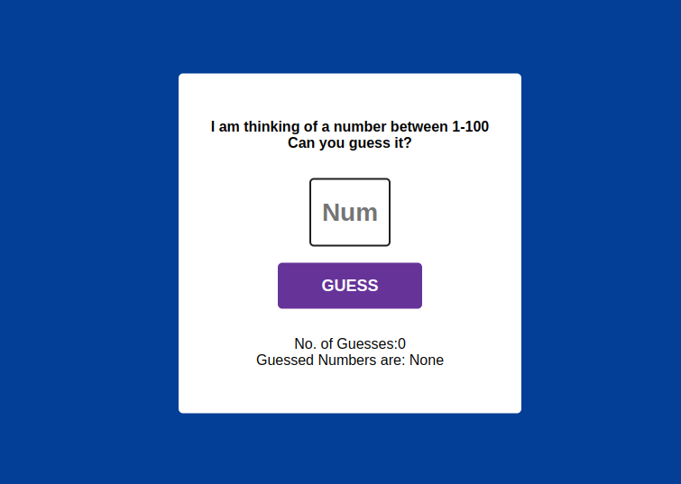

## Guessing Number Game

I have developed this Guessing Number game using HTML, CSS, and JavaScript.I have created this game to test my development and logic-building skills.

### Technologies Used
- HTML
- CSS
- JavaScript

### How to Play
1. To play the game, click the link: [Live Demo](https://irtiza1.github.io/GuessingNumberGame/).
2. The game will ask you to enter a number between 1 and 100.
3. Continue entering numbers until you successfully guess the correct number.
4. The game will provide feedback on whether your guess is too high or too low, helping you narrow down your next guess.

### Features
- Randomly generates a number between 1 and 100 for the player to guess.
- Provides feedback on whether the guess is too high or too low.
- Tracks the number of attempts made by the player.
- Allows the player to keep guessing until they succeed.
- Keeps track of the number of guesses of users.
- A message will pop up on the screen if a player enters a number beyond the range

### Demo
You can find a live game demo [here](https://irtiza1.github.io/GuessingNumberGame/).
